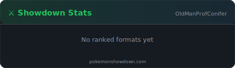

<div align="center">

# 🌲 Professor Conifer

### _"Weak Pokémon. Strong Pokémon. This is only selfish perception of people."_

**AI Researcher · Hobbyist Developer · One day aiming to be the _Very Best_**

---

<!-- Trainer Card -->


---

### 🔬 Research Focus

Building **[PsyMew](https://github.com/professor-conifer/PsyMew)** — a Pokémon Showdown battle bot powered by modern AI.

Exploring how LLMs (Gemini, Claude) reason about competitive Pokémon battles in real-time, combining function-calling tool use with Monte Carlo Tree Search for decision-making.

</div>

---

### ⚔️ Showdown Live Stats

<div align="center">



[OldManProfConifer](https://pokemonshowdown.com/users/oldmanprofconifer) on [Pokémon Showdown](https://play.pokemonshowdown.com/) · 🔄 Auto-updated every 6h

</div>

---

### 📊 GitHub Activity

<div align="center">


</div>

---

### 🧪 Projects

| Project | Description |
|---------|-------------|
| [**PsyMew**](https://github.com/professor-conifer/PsyMew) | Pokémon Showdown AI battle bot — Gemini & Claude decision engines with MCTS |
| _More coming soon..._ | _Stay tuned!_ |

---

### 🌿 About Me

```python
class ProfessorConifer:
    region = "Hoenn"
    types = ["Psychic", "Ghost", "Poison"]
    interests = ["AI", "Coding", "Pokémon", "Competitive Battling"]
    current_research = "LLM reasoning in video games"
    favorite_pokemon = ["Darkrai", "Gliscor", "Gardevoir", "Meowscarada"]
    motto = "Weak Pokémon. Strong Pokémon. This is only selfish perception of people."
```

<div align="center">

[](https://discord.com)

_<sub>🌱 Training to be the very best, one battle at a time.</sub>_

</div>
